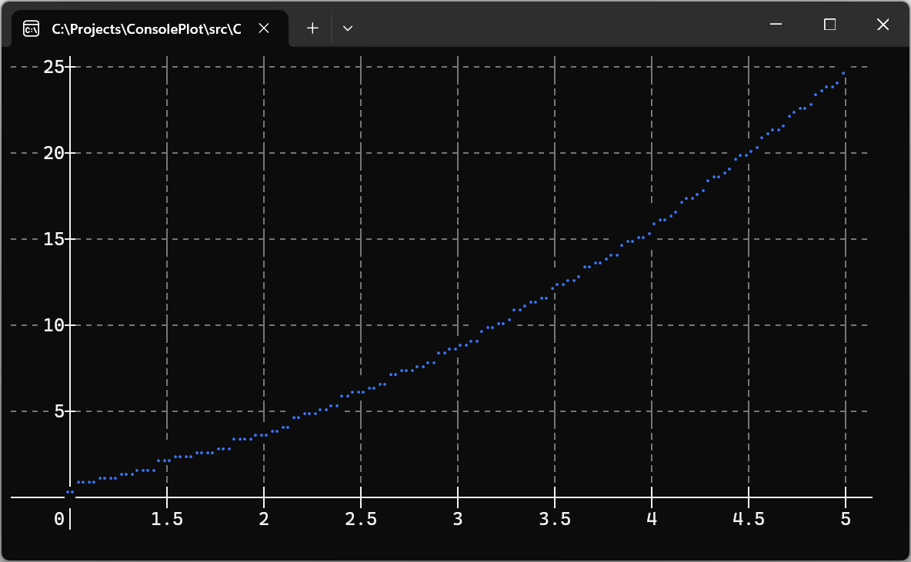

#  ConsolePlot

ConsolePlot is a .NET library for creating customizable line charts in the console.

Complete documentation is available at the [API documentation](docs/API.md).

[](https://www.nuget.org/packages/ConsolePlot)

## Quick Start

To use ConsolePlot, first install the [NuGet Package](https://www.nuget.org/packages/ConsolePlot):

```sh
dotnet add package ConsolePlot
```

Here's a simple example to get you started:

```csharp
using ConsolePlot;

Console.OutputEncoding = System.Text.Encoding.UTF8;

double[] xs = [1, 2, 3, 4, 5];
double[] ys = [1, 4, 9, 16, 25];

Plot plt = new Plot(80, 22);
plt.AddSeries(xs, ys);
plt.Draw();
plt.Render();
```

This will create a simple plot in your console:



## Features

- Customizable axis, grid, ticks and chart lines.
- Support for multiple data series.
- Adaptive scaling: automatically adjusts the plot to fit the console window, ensuring round axis labels, optimal tick placement, and alignment with console cells.

## Examples

You can find various usage examples in the [ConsolePlot.Examples](src/ConsolePlot.Examples) project.

### Running Examples in Visual Studio:
1. Clone this repository by clicking "Open with Visual Studio" on the GitHub page.
2. Open the solution and set `ConsolePlot.Examples` as the startup project.
3. Run the project.

### Running Examples from the Command Line:
```sh
git clone https://github.com/sumrix/ConsolePlot.git
cd ./ConsolePlot/src
dotnet build
dotnet run --project ConsolePlot.Examples
```

## Contributing

Bug reports and contributions are welcome. Please submit them via the [Issues](https://github.com/Sumrix/ConsolePlot/issues) or [Pull Requests](https://github.com/Sumrix/ConsolePlot/pulls).